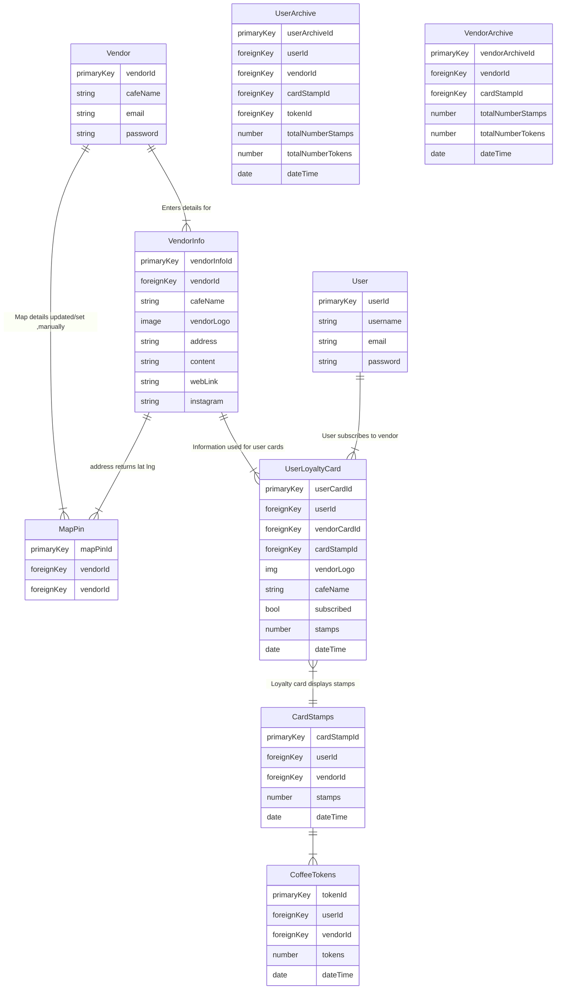
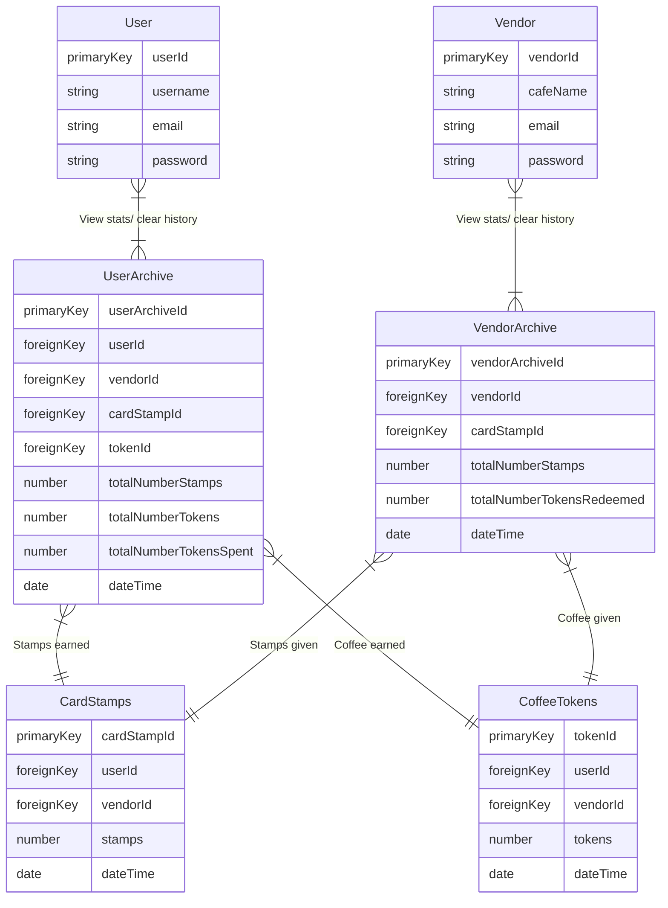

# Diagrams for database layout and relationships
[Back to README](/Documents/Word-PDF/README.md)
## Physical model
This model outlines the framework for collecting and displaying users loyalty card stamps and coffee tokens. The relationships established between collections enable the tracking and administration of user and vendor data. 

### Diagram breakdown

#### Vendor Processes:

1. Vendors can register.
2. Vendors can provide information about themselves.
3. Vendors can update map details manually.

#### User Processes:

1. Users can register.
2. Users can subscribe to vendors.
3. Users can accumulate stamps on their loyalty cards by purchasing coffee.
4. Users can accumulate and spend coffee tokens. 

#### Interactions:

1. When a user subscribes to a vendor or purchases a coffee, a loyalty card is created for that vendor. 
2. Users can earn stamps on their loyalty cards by making purchases.
3. Users can earn coffee tokens by collecting enough stamps at a single vendor. 

### Archived data

This diagram outlines the structure for storing long-term stats for users and vendors.

[Back to top](#)