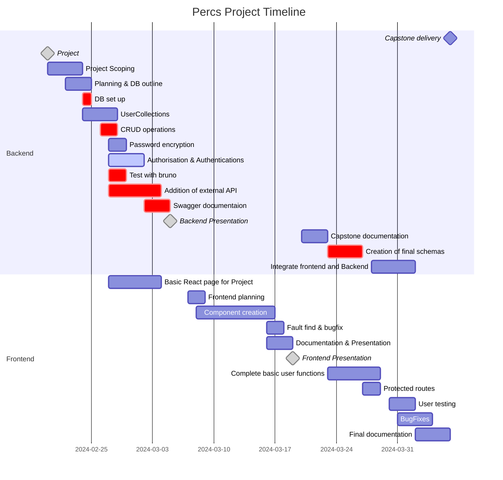

```mermaid
gantt
    dateFormat  YYYY-MM-DD
    title Percs Project Timeline

    section Backend
    Capstone delivery :milestone, 2024-04-06, 
    Project :milestone, done, 2024-02-20,
    Project Scoping  : a1,  2024-02-20, 4d
    Planning & DB outline :  2024-02-22, 3d
    DB set up :crit,  2024-02-24, 1d
    UserCollections :  2024-02-24, 4d
    CRUD operations :crit,  2024-02-26, 2d
    Password encryption :  2024-02-27, 2d
    Authorisation & Authentications :active,  2024-02-27, 4d
    Test with bruno :crit, 2024-02-27, 2d
    Addition of external API :crit, 2024-02-27, 6d
    Swagger documentaion : crit, 2024-03-02, 3d
    Backend Presentation :milestone, done, 2024-03-05,
    Capstone documentation : 2024-03-20, 2024-03-23
    Creation of final schemas :crit, 2024-03-23, 2024-03-27
    Integrate frontend and Backend : 2024-03-28, 2024-04-02


    section Frontend
     
    Basic React page for Project: 3 :, 2024-02-27, 2024-03-04
    Frontend planning :, 2024-03-07, 2024-03-09
    Component creation :, 2024-03-08, 2024-03-17
    Fault find & bugfix :, 2024-03-016, 2024-03-18
    Documentation & Presentation :, 2024-03-016, 2024-03-19
    Frontend Presentation :milestone, done, 2024-03-19
    Complete basic user functions : 2024-03-23, 2024-03-29
    Protected routes : 2024-03-27, 2024-03-29
    User testing : 2024-03-30, 2024-04-02
    BugFixes : 2024-03-31, 2024-04-04
    Final documentation : 2024-04-02, 2024-04-06

    


```