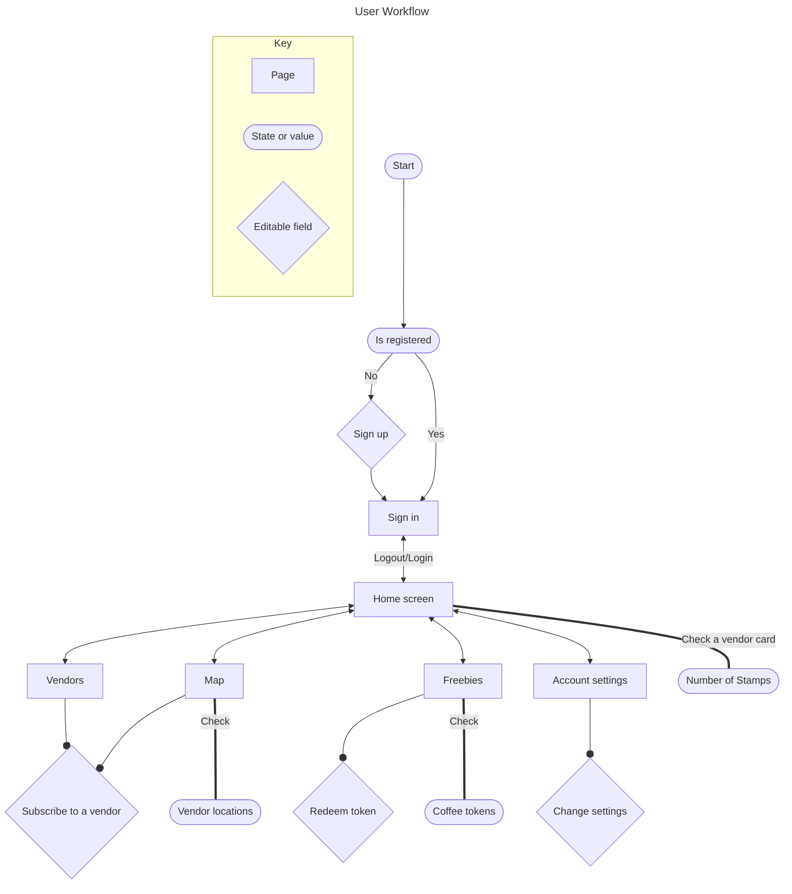
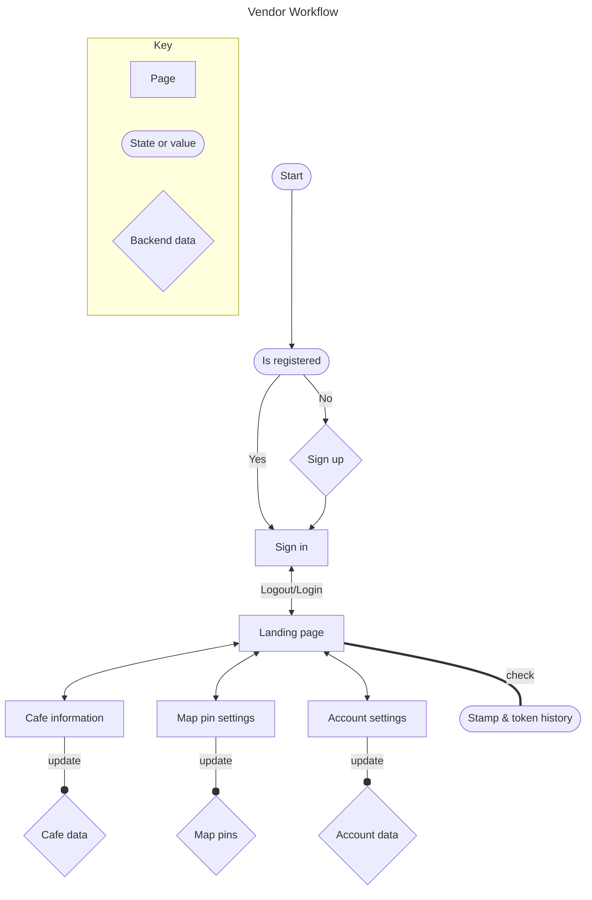

# Workflow Diagrams

## User Workflow
This diagram outlines the end users workflow as they navigate the program.

### Mermaid Diagram

### Diagram breakdown

**Key:**
- **Page:** A page rendered within the application
- **State or value:** User state or non-interactive information.
- **Editable field:** Interactive information or fields used to update backend data

**Start:**  

**Registration status:**  
- Check if the user is registered. 
- If not registered, proceed to sign up.  

**Sign up:**  
- User signs up for account.  
- Once or if already registered, proceed to sign in.  

**Sign in:**   
- The user signs in and is taken to the home screen.  

**Home screen:**
- The user lands on the home screen. 
- From here, the user can navigate to different pages such as the map, vendors, freebies, and account settings interchangeably. 
- The number of stamps can be checked for any subscribed vendor  

**Map:**  
- User views the map, can use the search function or tap on vendor pins for more information.  

**Vendors:**  
- The user views available vendors.
**Freebies:**  
- The user can view available coffee tokens and redeem tokens from this page. 

**Account settings:**   
- The user accesses and change their account settings.   

## Vendor WorkFlow
Vendor workflow is outlined in the following diagram.

### Mermaid Diagram

### Diagram Breakdown

**Key:**
- **Page:** A page rendered within the application.
- **State or value:** Vendor's state or non-interactive information.
 -**Backend data:** Data fetched or posted from the backend.

**Start:**   

**Registration status:**  
- Check if the vendor is registered. 
- If not registered, proceed to sign up.  

**Sign up:**  
- Vendor signs up for account.  
- Once or if already registered, proceed to sign in.  

**Sign in:**   
- The vendor signs in and is taken to the Landing page.  

**Landing Page:**  
- The vendor can navigate to different pages such as cafe information, map pin settings, and account settings.   
- The vendor can check stamp and token history.   
**Cafe Information:**   
- Vendor views and updates cafe information.   
**Map Pin Settings:**
- Vendor views and updates map pin settings.   

**Account Settings:**
- Vendor accesses and updates account settings.   

**Stamp & Token History:**
- Vendor checks stamp and token history for their cafe.