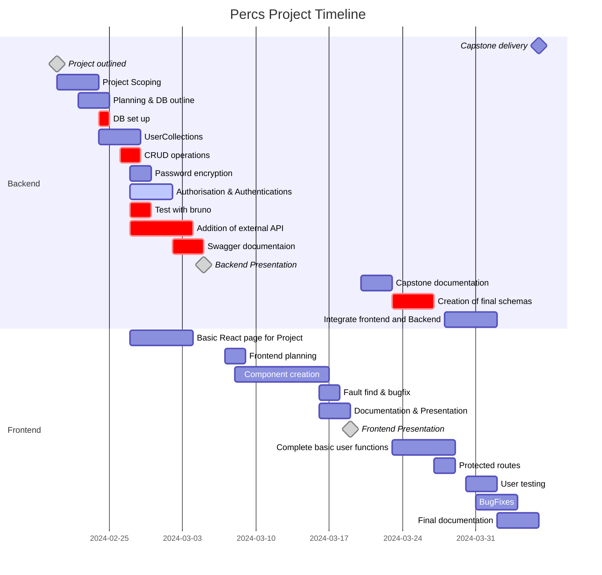
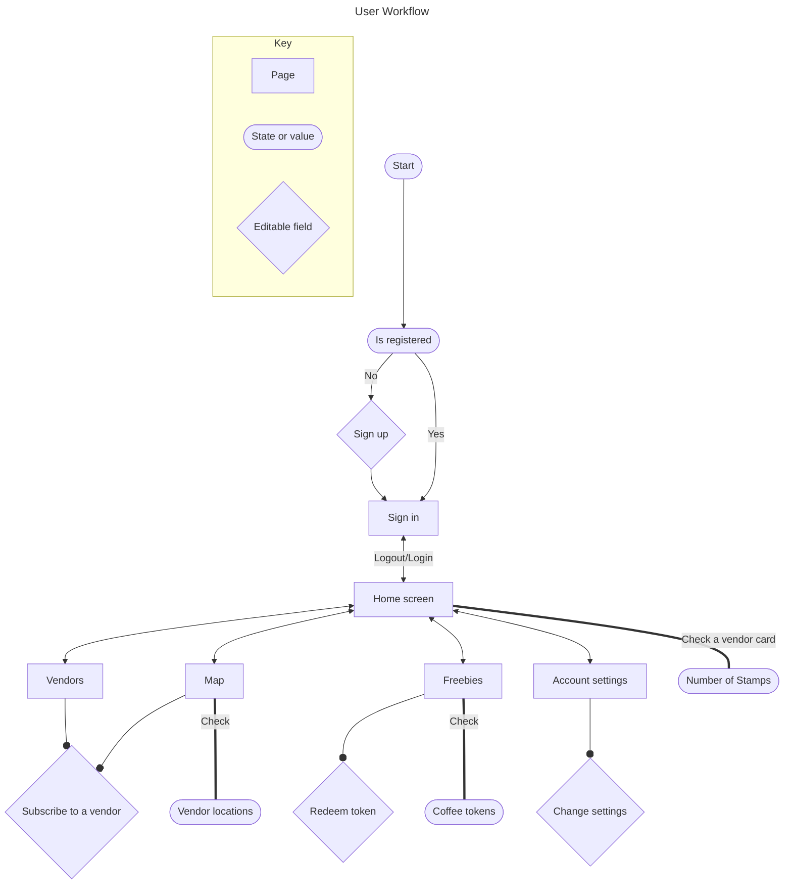

<div align="center">

</br></br>

</br></br>

</div>

# README: Percs

Percs is an electronic coffee loyalty card platform which allows customers to search, save and locate participating cafes and restaurants.
</br>

---

### Table of Contents


- [Introduction](#table-of-contents)
- [Background](#background)
- [Features](#features)
- [Time Line](#time-line)
- [Workflow](#workflow)
- [Technologies Used](#technologies-used)
- [Usage](#usage)
- [File Structure](#file-structure)
- [Testing](#testing)
- [Contact](#contact)
- [Changelog](#changelog)

<br>

---

## Background

Throughout the world New Zealand's coffee culture is renowned as being one of the best. With so many great options available it can be difficult to get your brand visible. One way of promoting cafes in the past has been the use of coffee cards. Although cards are easy advertisement, they are frequently lost, discarded or forgotten about, typically only being utilized by the most loyal customer.</br></br>
Percs provides a modern solution to these problems, a mobile app that allows customers to quickly find and save your coffee card. Utilizing a map and itemized lists customers are able to view and share your business with ease. Coffee cards will never again be left at home or put through the wash. Quick access will keep your business at the front of the customers mind when out and about. The map features allows customers to easily find your business while exploring new locales.</br></br>
In addition to providing greater visibility for businesses implementation is simple, ongoing costs are lower compared to physical coffee cards and sustainability is improved. By joining in partnership with Percs you will be continuing to promote our unique coffee culture as well as your personal brand.

<div style="text-align: right;">

> [Table of Contents](#table-of-contents) <br>

</div>
<br>

## Features:

Percs as a project aims to provide two main workflows, currently the focus has been on creating the backend and customer facing interface. outlined below are the current features and their stages of development

> For a more detailed task list click [HERE](tasklist.md)


### _Implemented features:_

- User sign up:
  - Implemented user registration form with username, email and password.
  - Utilized validation to ensure that the email is unique and meets certain criteria.
  - Stored user credentials securely in the database using encryption techniques.

- User sign in:
  - Implemented a login form with fields for email and password.
  - Validated user credentials against stored data in the database.

- Change user settings:
  - Implemented a settings page where users can update their username.
  - Validated user input before updating the database to maintain data integrity.

- Delete account:
  - Implemented a feature to allow users to delete their accounts permanently.


- View vendor data from map page:
  - Integrated a map component displaying vendor locations.
  - Implemented functionality to fetch and display vendor data dynamically based on map interactions.
  - Included filtering options to refine vendor search results.

- View number of stamps on a vendor's loyalty card:
  - Developing a feature to display the number of loyalty stamps collected by the user at a particular vendor.
  - Implementing logic to track and update stamp counts upon each purchase.

- Save vendors for access from home page:
  - Developing functionality to allow users to save favorite vendors for quick access.
  - Interface for managing saved vendors.

- Redemption of tokens:
  - Enables users to redeem tokens for coffees at participating vendors.
  - Implementing logic to deduct tokens from the user's account upon redemption.

### _Planned features:_

- Vendor portal:
  - Creating a separate portal for vendors to manage their accounts and view customer data.

- Authentication:
  - Implementing authentication for enhanced security.

- Quick access of tokens through a "wallet":
  - Developing a digital wallet feature where users can conveniently store and manage their tokens.
  - Implementing options for transferring tokens between users or redeeming them at vendors.

- Gamification:
   - Use a physical "Stamp" (NFC tag) to provide sensory feedback of earning stamps
   - Leader boards for tokens earned or stamps collected at particular vendors  


<div style="text-align: right;">

> [Table of Contents](#table-of-contents) <br>

</div>
<br>

## Time Line

The project has been organized into a structured framework, separating its development process into three two weeks phases. This approach aids, focus and clarity throughout the project's lifecycle.

Sprint One, was dedicated to the backend development. During this sprint, the core functionalities, data models, and logic pertaining to the project's backend infrastructure were implemented. The end of the sprint was marked by a presentation of the functionalities.

Following Sprint One, the project to Sprint Two, where focus shifted towards frontend development. In this phase, the user interface (UI), user experience (UX) , and frontend functionalities were built. This phase aimed to deliver a visually appealing, intuitive, and responsive frontend interface. Again the end of the sprint was capped with a presentation of progress.

Sprint Three centered on integration and documentation. During this phase, the backend and frontend components developed in the previous sprints were integrated to form a functional product. Additionally,  documentation was generated, detailing the project's architecture, functionalities, APIs, and usage instructions. This documentation serves as a resource for developers to troubleshoot integrate and make enhancements.




<div style="text-align: right;">

> [Table of Contents](#table-of-contents) <br>

</div>
<br>

## Workflow

This diagram outlines the end users workflow as they navigate the program.

### Mermaid Diagram

### Diagram breakdown

**Key:**
- **Page:** A page rendered within the application
- **State or value:** User state or non-interactive information.
- **Editable field:** Interactive information or fields used to update backend data


**Start:** <br>

**Registration status:** <br>
- Check if the user is registered.<br>
- If not registered, proceed to sign up. <br>

**Sign up:** <br>
- User signs up for account. <br>
- Once or if already registered, proceed to sign in. <br>

**Sign in:** <br> 
- The user signs in and is taken to the home screen. <br>

**Home screen:**
- The user lands on the home screen.<br>
- From here, the user can navigate to different pages such as the map, vendors, freebies, and account settings interchangeably.<br>
- The number of stamps can be checked for any subscribed vendor <br>

**Map:** <br>
- User views the map, can use the search function or tap on vendor pins for more information. <br>

**Vendors:** <br>
- The user views available vendors.
**Freebies:** <br>
- The user can view available coffee tokens and redeem tokens from this page.<br>

**Account settings:** <br> 
- The user accesses and change their account settings. <br><br>


<div style="text-align: right;">

> [Table of Contents](#table-of-contents) <br>

</div>
<br>

## Technologies Used

The project utilizes a variety of technologies across backend, frontend, and development tools to create a robust application. These technologies enable the development, deployment, and management of the project. They are as follows:

#### Backend:
- **Node.js**: JavaScript runtime environment used for server-side development.
- **Express.js**: Web application framework for Node.js used to build the backend server.
- **MongoDB**: NoSQL database used to store application data.
- **Mongoose**: MongoDB object modeling tool used to design schemas and interact with the database.
- **bcrypt.js**: Library used for password hashing.
- **Swagger**: API documentation tool used to generate API documentation.
- **Bruno**: Unit testing framework used to test backend operations.
- **Docker**: Containerization platform for developing, shipping, and running applications.

#### Frontend:
- **React.js**: JavaScript library used for building user interfaces.
- **React Router**: Library used for routing in React applications.
- **Axios**: Promise-based HTTP client used to make API requests from the frontend.
- **HTML/CSS**: Markup and styling languages used for frontend development.
- **JavaScript (ES6+)**: Programming language used for frontend scripting.
- **Material UI:** React components library implementing Google's Material Design for UI development.
- **Vite**: Build tool used for faster development and bundling of frontend assets.
- **@vis.gl/react-google-maps**: Library providing React components for integrating Google Maps.
- **Yup**: JavaScript schema builder for value parsing and validation.
- **React-hook-form**: Library for managing form state and validation in React applications using React Hooks.

#### Development Tools:
- **VSCode**: Code editor used for development.
- **GitHub**: Platform used for hosting code repositories and collaboration.
- **MongoDB Compass**: GUI for MongoDB used for database management and visualization.
- **NPM**: Package managers used for installing and managing project dependencies.
  


<div style="text-align: right;">

> [Table of Contents](#table-of-contents) <br>

</div>
<br>

## Usage

To use this project, follow the instructions below:

#### Prerequisites
- Node.js and npm installed on your machine
- MongoDB installed locally or accessible through a cloud service (e.g., MongoDB Atlas)

#### Installation
1. Clone the repository to your local machine.

2. Navigate to the project directory.

3. Install the necessary npm packages for both the backend and frontend.
	```
	npm i
	```


#### Launching the Frontend
1. To start the React.js frontend, run the following command:
   ```
   npm run dev
   ```
   This will concurrently start the React development server and the backend server.
   
2. Access the application by navigating to  `http://localhost:5173/` in your web browser.


#### Launching the Backend
1. To start the backend server, run the following command:
   ```
   npm start
   ```
   This will start the Express.js server at `http://localhost:8080/`.

To add collections from JSON files to your MongoDB database, you can follow these instructions:

##### Adding Collections from JSON Files to MongoDB

1. **Ensure MongoDB is Running**:
   - Make sure your MongoDB server is running either locally or accessible through a cloud service.

2. **Navigate to Project Directory**:
   - Open your terminal or command prompt and navigate to the project directory where your project is located.

3. **Add JSON Files to Project**:
   - Place the JSON files containing your data collections within your project directory.

4. **Import JSON Data into MongoDB**:
   - Use the `mongoimport` command-line tool provided by MongoDB to import the JSON data into your MongoDB database. The basic syntax is as follows:

     ```
     mongoimport --db <database_name> --collection <collection_name> --file <path_to_json_file>
     ```
     Replace `<database_name>` with the name of your MongoDB database, `<collection_name>` with the name you want to give to your collection, and `<path_to_json_file>` with the path to your JSON file.


5. **Run mongoimport Command**:
   - Execute the `mongoimport` command in your terminal or command prompt. For example, if you have a JSON file named `Pin.json` containing user data and you want to import it into a collection named `Pin` in your MongoDB database named `percsDB`, the command would look like this:
	 ```
	 mongoimport --db percsDB --collection Pin --file ..\docs\Collections\Pin.json
	 ```
   - Repeat this step for each JSON file you want to import as a collection.

6. **Verify Data**:
   - After importing, you can verify that the data has been successfully added to your MongoDB database by connecting to your database using MongoDB Compass, the MongoDB shell, or any other MongoDB client.

Following these steps, you should be able to add collections from JSON files to your MongoDB database.


#### Additional Notes
- Ensure that your MongoDB server is running either locally or accessible through a cloud service and configure the connection URI in `config/default.json`.
- Make sure ports 5173 (frontend) and 8080 (backend) are available and not in use by other services.
- You may need to set up environment variables for sensitive information such as database credentials, API keys, etc., in a `.env` file.
<div style="text-align: right;">

> [Table of Contents](#table-of-contents) <br>

</div>
<br>

## File Structure

<div style="display: grid; grid-template-columns: 1fr 1fr;">
<div  >
The file structure of this project can be broken into three main sections. They are the front end, back end and documentation. Further breakdown of folders can be seen in the document tree to the right.

### _Backend_

Separated into a basic MVC model using Routes, models and controllers to handle the required back end operations.

### _Frontend_

React front end utilizing components and reusable sections of code to build an interactive and intuitive interface for the end user.

### _Documents_

A folder containing early notes, drafts and mock-ups. As well as a comprehensive breakdown of project content progress and future direction.

</div>
<div >

```
.
├── .github
├── .vscode
├── backend
│   ├── config
│   ├── controllers
│   ├── middleware
│   ├── mini-project-3-backend
│   ├── models
│   ├── routes
│   └── .env
├── dbConnect.js
├── package-lock.json
├── package.json
└── percs-api.json
├── server.js
└── Documents
│   ├── Chart
│   ├── Illustration
│   ├── Mock-up
│   ├── Other
│   ├── Powerpoint
│   └── Word-PDF
├── frontend
│   ├── src
│   │   ├── assets
│   │   ├── components
│   │   ├── config
│   │   ├── pages
│   │   ├── styles
│   │   ├── utils
│   │   ├── App.css
│   │   ├── App.jsx
│   │   ├── index.css
│   │   └── main.jsx
│   └── index.html
├── .eslintrc.cjs
├── .gitignore
├── README.md
├── package-lock.json
├── package.json
└── vite.config.js

```

</div>
</div>

<div style="text-align: right;">

> [Table of Contents](#table-of-contents) <br>

</div>
<br>


## Testing

This document outlines the process of testing the CRUD operations within the Percs project. <br>


### Bruno
The unit testing uses Bruno as the interface for performing testing, if installation is required a download link can be found [HERE](https://www.usebruno.com/downloads).

Once Bruno is installed locally access the unit tests by opening a collection and selecting **bruno-unit-testing**.

---

### User CRUD Operations Testing


#### Testing Environment
- Percs project deployed locally at `http://localhost:8080`

#### User Operations
The following CRUD operations will be tested:
1. **Create User**
2. **Get Users**
3. **Update User**
4. **Delete User**
5. **Login**

---

### Testing Procedure

Certainly! Here's the updated testing procedure with error messages added to the expected responses:

---

### Testing Procedure

#### 1. Create User

##### Request:
```http
POST http://localhost:8080/users/create
Content-Type: application/json

{
  "username": "The Jester",  
  "email": "brejcha@mail.com",
  "password": "password"
}
```

##### Expected Response:
- HTTP Status Code: 200 OK
- Response Body: User object containing user details including unique userID.
<br><br>

- HTTP Status Code: 500 Internal Server Error
- Response Body: Error message in case of failure, e.g., "Error creating user: {error_message}"
<br>
#### 2. Get Users

##### Request:
```http
GET http://localhost:8080/users/
```

##### Expected Response:
- HTTP Status Code: 200 OK
- Response Body: Array of user objects containing user details.
<br>

- HTTP Status Code: 500 Internal Server Error
- Response Body: Error message in case of failure, e.g., "Error fetching users: {error_message}"

#### 3. Update User

##### Request:
```http
PUT http://localhost:8080/users/{userID}
Content-Type: application/json

{
  "_id": "65ced20bdaba65aca52ac5d3",
  "username": "Boris Brejcha",
  "email": "brejcha@mail.com",
  "password": "password"
}
```

##### Expected Response:
- HTTP Status Code: 200 OK
- Response Body: Updated user object containing the modified user details.
<br>

- HTTP Status Code: 500 Internal Server Error
- Response Body: Error message in case of failure, e.g., "Error updating user: {error_message}"

#### 4. Delete User

##### Request:
```http
DELETE http://localhost:8080/users/{userID}
Content-Type: application/json

{
  "id": "{userID}"
}
```

##### Expected Response:
- HTTP Status Code: 200 OK
<br>

- HTTP Status Code: 404 Not Found
- Response Body: Error message if user with the given ID doesn't exist, e.g., "User not found"

- HTTP Status Code: 500 Internal Server Error
- Response Body: Error message in case of other failures, e.g., "Error deleting user: {error_message}"

#### 5. Login

##### Request:
```http
POST http://localhost:8080/users/login
Content-Type: application/json

{
  "email": "brejcha@mail.com",
  "password": "password"
}
```

##### Expected Response:
- HTTP Status Code: 200 OK
- Response Body: Authentication token for the logged-in user.
<br>

- HTTP Status Code: 400 Bad Request
- Response Body: Error message in case of wrong username or password, e.g., "Wrong username or password"

- HTTP Status Code: 500 Internal Server Error
- Response Body: Error message in case of other failures, e.g., "Error logging in: {error_message}"

### Conclusion
The unit testing for user CRUD operations within the Percs project should ensure that each operation functions correctly and returns the expected responses, including appropriate error messages.
<br><br>
<div style="text-align: right;">


</div>

<!-- TODO: list the basics of the backend bruno testing create a complete testing doc -->
<div style="text-align: right;">

> [Table of Contents](#table-of-contents) <br>

</div>
<br>


## Contact
For inquiries or support, please contact:

- Ethan Hyndman (notmyemail@gmail.com)


<div style="text-align: right;">

> [Table of Contents](#table-of-contents) <br>

</div>
<br>

## Changelog

### 0.5.0 - 5-04-2024
- **Added:** Presentation build released.

<div style="text-align: right;">


> [Back to top](#)

</div>
<br>
